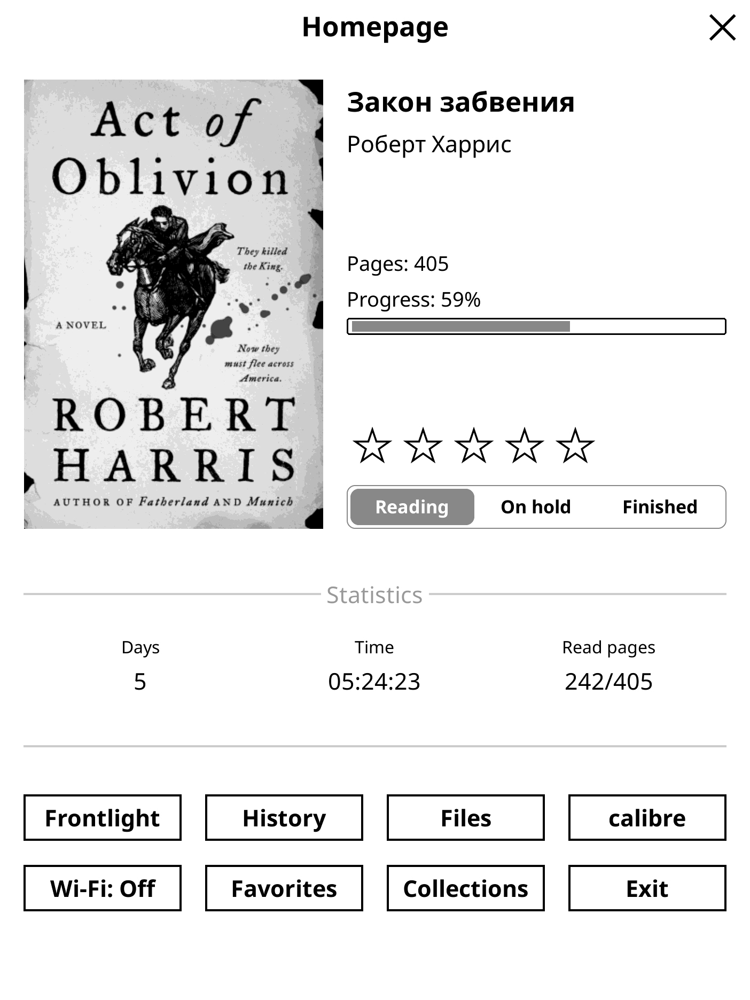

# Homepage plugin for KOreader
The plugin adds to KOReader the ability to display a screen with basic book information, a rating, reading status, and several buttons when the application starts and at the end of a book.

## Home Page screen
<kbd></kbd>

## File manager settings
<kbd></kbd>
<kbd></kbd>

## Reader settings
<kbd></kbd>
<kbd></kbd>
<kbd></kbd>
